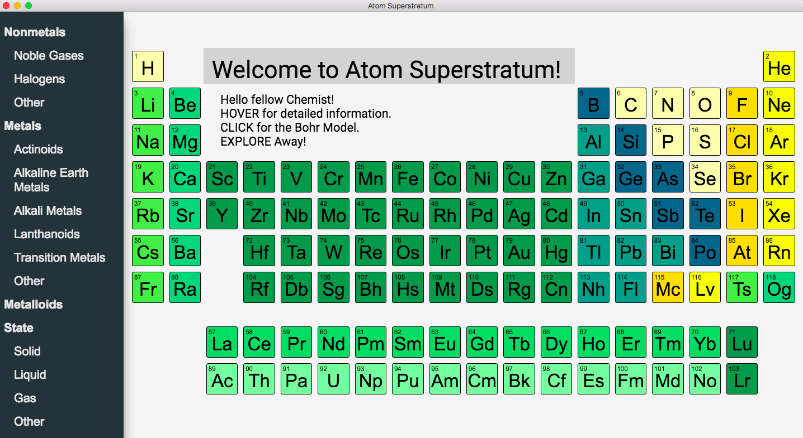
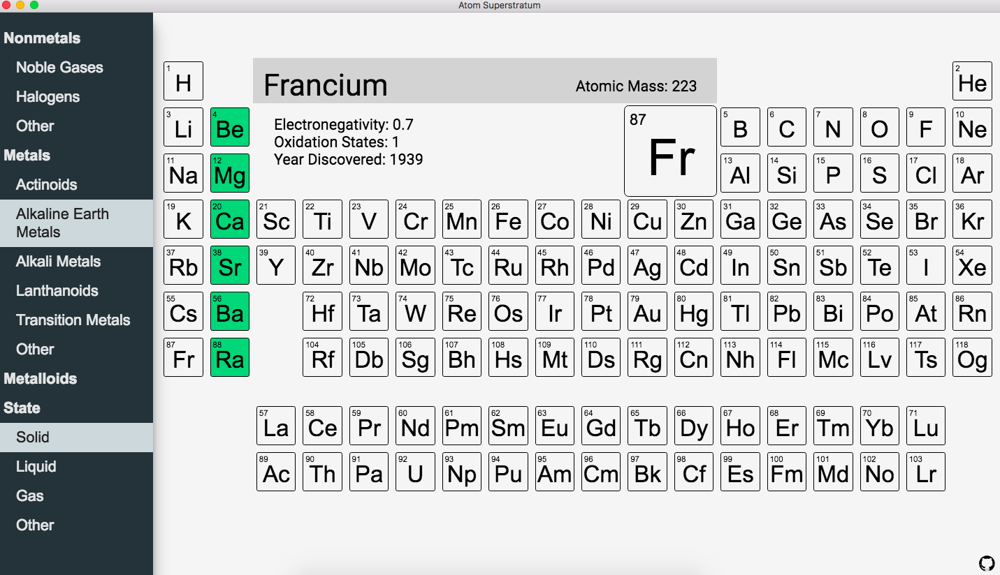
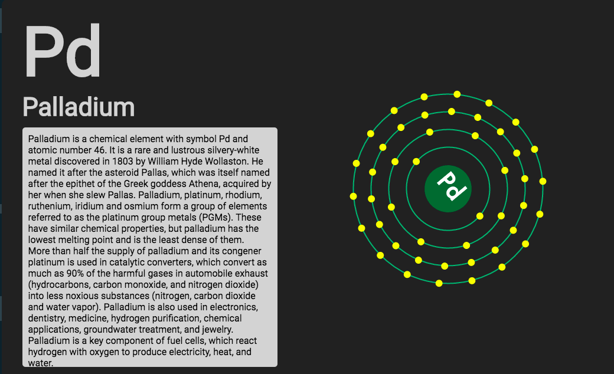

# Atom Superstratum

Interactive Periodic Table with a clean user experience, detailed information, togglable filters, and animationed Bohr Models.

Click on the Element to learn more and see its Bohr Model!

Thanks to this fellow team of mad scientists and web developers for creating this with me: [Justyna Foster](https://github.com/SoleNero), [Kyle Joyce](https://github.com/joyceky/), [Aidan Baack](https://github.com/aebaack), [Kevin Cowley](https://github.com/cowleyk), [Thomas Sarkinson](https://github.com/thcmm).
